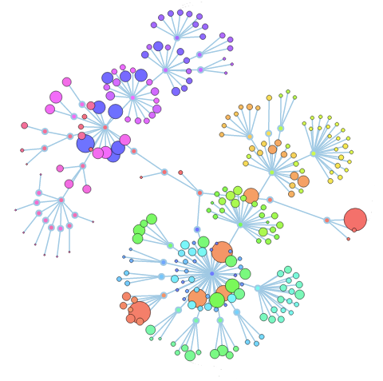

# directoryflower
This project visualizes a directory and its files using an interactive tree. Each disc represents a file, with a radius proportional to the number of lines of code (loc). All rendering is done client-side, in JavaScript. Built with <a href="https://github.com/mbostock/d3">d3.js</a>. It is based upon <a href="http://www.redotheweb.com/CodeFlower/">CodeFlower</a> from François Zaninotto.

The change to the original CodeFlower is that it now directly can read the data from a csv file that is generated by the tool <a href="http://cloc.sourceforge.net/">cloc</a>.

# usage
1. Run the tool <a href="http://cloc.sourceforge.net/">cloc</a> in a directory: `cloc <directory> --csv --by-file --report-file=directory_structure.cloc`
1. Put the generated file in the same directory as the html file.
1. Start a web server: `python -m http.server 8000`
1. In your browser goto `localhost:8000`

# example output
